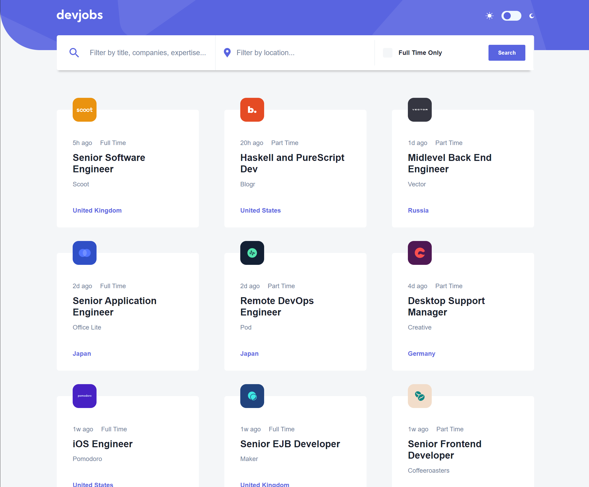
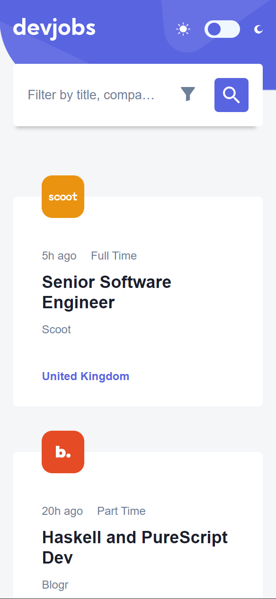

# Proyecto resuleto de Frontend Mentor - Devjobs web app

## Descripción

Este proyecto esta hecho en [React con Vite](https://es.vitejs.dev/) usando Typescript y un paquete de rutas llamado [Wouter](https://www.npmjs.com/package/wouter).  
La finalidad de este proyecto es resolver el reto de [Devjobs web app](https://www.frontendmentor.io/challenges/devjobs-web-app-HuvC_LP4l) y practicar mis habilidades en React.

Dentro de este proyecto podras encontrar el proyecto en figma junto con todos sus recursos para poder trabajar en el.

### Cosas implementadas

- Un buscador con multiples filtros asociados entre si
- Soporte para dispositivos moviles
- Dark Mode
- Rutas con Wouter
- Uso de Typescript con modelos para los datos

### Cosas a implementar a futuro

- [ ] Agregar un skeleton loader para cuando se esten cargando los datos
- [ ] Conectar con algub backend para poder obtener los datos o usar firebase
- [ ] Mejorar la carga de los datos y cambiar el actual solo si se usa una api

## Ejectuar el proyecto

Para ejectuar el proyecto solo debes de ejectuar el comando `npm run dev` y se abrira una ventana en tu navegador con el proyecto ejectuandose.

### Vista de escritorio

### Vista de movil

